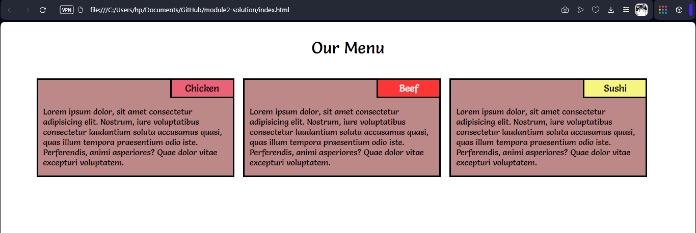
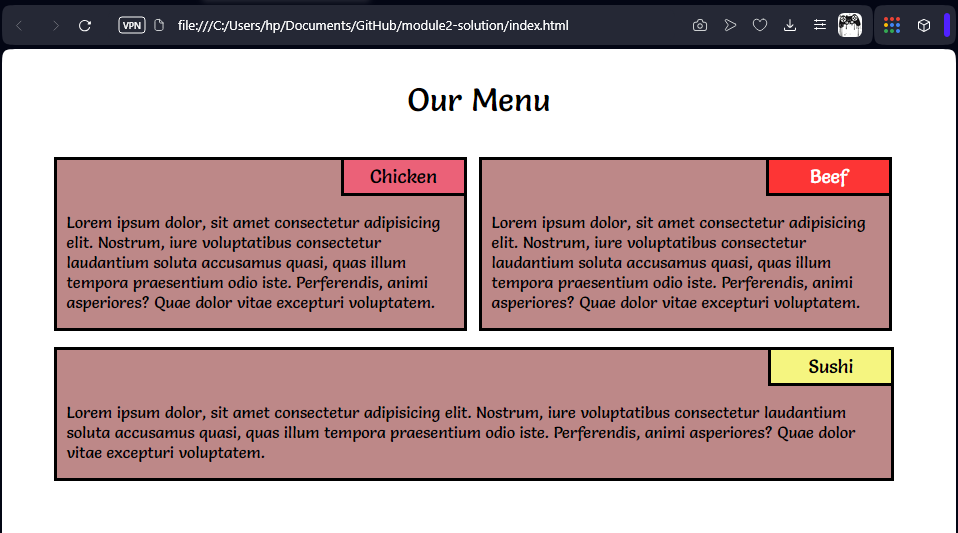
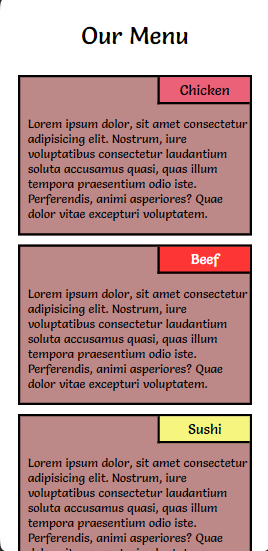

This is the solution to the given problem statement

***
https://github.com/jhu-ep-coursera/fullstack-course4/blob/master/assignments/assignment2/Assignment-2.md
***

This code constructs a responsive paragraph layout, which adjust the number of cards displayed side by side.
In this problem statement, I have used media quereies to determine size of the screen

LAPTOP LAYOUT

TABLET LAYOUT

MOBILE LAYOUT

